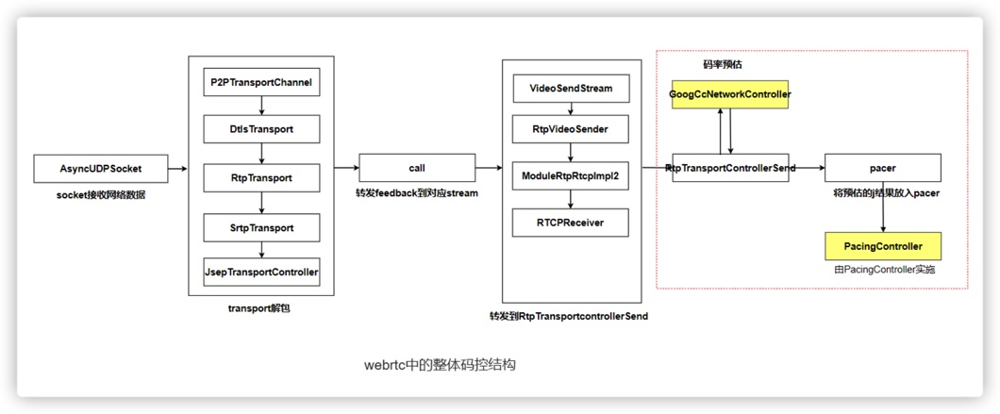
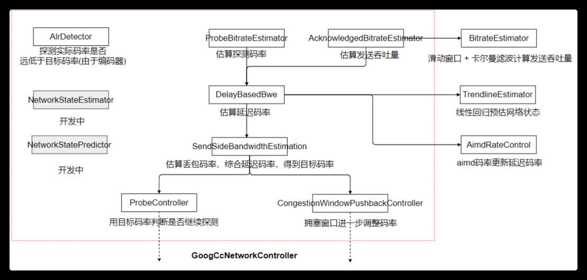

# README

This folder contains a modified/adapted subset of the libwebrtc library, which is used by mediasoup for transport congestion purposes.

* libwebrtc branch: m77
* libwebrtc commit: 2bac7da1349c75e5cf89612ab9619a1920d5d974

The file `libwebrtc/mediasoup_helpers.h` includes some utilities to plug mediasoup classes into libwebrtc.

The file `worker/deps/libwebrtc/deps/abseil-cpp/abseil-cpp/absl/synchronization/internal/graphcycles.cc` has `#include <limits>` added to it to fix CI builds with Clang.

# 一、正文

## 1、整体框架

  WebRTC中有得部分码控结构如下图所示，从socket层接收到数据后，到transport解析rtcp包处理得到feedback，通过call将feedback转发到对应sendstream上的rtcp处理模块，最终通过RtpTransportControllerSend将feedback转发到GoogCcNetworkContoller解析码率预估后，把预估的码率（target bitrate），探测策略（probe config），congestion  windows给pacer，pacer转发给pacingContrller去使用进行发送码率控制

其中以GoogCcNetworkController作为整个码率预估及调整的核心，涉及的类和流程如下图所示，红框中的类在GoogCcNetworkController下

1. ProbeBitrateEstimator：根据feedbak计算探测码率，PacingController中会将报按照cluster进行划分，transport-CC报文能得到报所属的cluster以及发送和接受信息，通过发送和接收的数据大小比判断是否到达链路上限从而进行宽带探测。

2. AcknowledgedBBitrateEstimator: 估算当前的吞吐量

3. BitrateEstimator: 使用滑动窗口 + 卡尔曼滤波计算当前发送吞吐量

4. DelayBaseBBwe: 基于延迟预估码率

5. TrendlineEstimator：使用线性回归技术当前网络拥堵情况

6. AimdRateControl：通过TrendLine预测出来的网络整体对码率进行aimd方式调整

7. SendSideBandwidthEstimation：基于丢包计算预估码率，结合延迟预估码率，得到最终的目标码率

8. ProbeController：探测控制器，通过目前码率判断下次是否探测，探测码率大小

9. CongestionWindowPushbackController： 基于当前的rtt设置一个时间窗口，同时基于当前码率设置当前时间窗口下的数据量，通过判断当前窗口的使用量，如果使用量过大的时候，降低编码时使用的目标码率，加速窗口消退，减少延迟

10. AlrDetector：应用（码率）受限检测， 检查当前的发送码率是否和目标码率由于编码器等原因相差过大受限了， 受限情况下会触发带宽预测过程的特殊处理

11. NetworkSateEstimator、NetworkStateProdictor：此两者属于待开发类，只是在代码中有，但是还没开发完，没用上。

